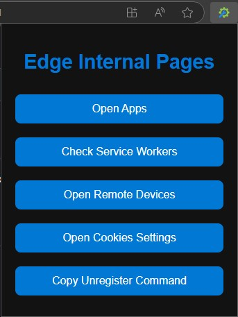

# Edge Internal Pages Extension

A simple browser extension designed to automate and simplify navigation to common internal pages in Microsoft Edge. It also includes features to copy useful commands for managing service workers.

## Features
- **Open Internal Pages:** Quickly navigate to internal pages like:
  - Edge Apps (`edge://apps`)
  - Service Worker Internals (`edge://serviceworker-internals/`)
  - Inspect Devices (`edge://inspect/#devices`)
  - Cookies Settings (`edge://settings/content/cookies/siteData?searchSubpage`)
- **Copy Commands:** Easily copy the command to unregister all service workers with a single click.

## Installation

To use this extension, follow these steps:

1. **Download the Extension:**
   - Select **Download ZIP** and save the file to your computer.
   - Extract the downloaded ZIP file to a folder on your system.

2. **Load the Extension in Microsoft Edge:**
   - Open Microsoft Edge.
   - Navigate to `edge://extensions/` in the address bar.
   - Enable **Developer Mode** by toggling the switch in the lower-left corner of the page.
   - Click **Load unpacked** and select the folder where you extracted the extension files.
   - The extension should now appear in your list of installed extensions.

## Permissions
The extension requires the following permissions:
- **`clipboardWrite`:** To copy commands to the clipboard.
- **`activeTab` and `tabs`:** To open internal pages in new tabs.

## Screenshots
 

## Contributing
Contributions are welcome! Feel free to fork the repository and submit a pull request.

## License
This project is licensed under the MIT License. See the [LICENSE](LICENSE) file for details.

---

### Disclaimer
This extension works only on Microsoft Edge and cannot directly interact with `edge://` pages due to browser restrictions. Use the copied commands manually for full functionality.
